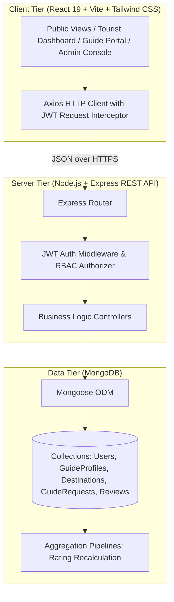
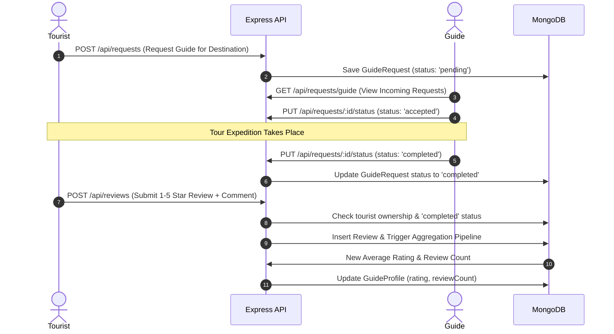

# 🏞️ Chhattisgarh Tourist Guide Platform (CGTourist)

[](https://en.wikipedia.org/wiki/MEAN_(solution_stack))
[](https://react.dev/)
[](https://vitejs.dev/)
[](https://tailwindcss.com/)
[](https://nodejs.org/)
[](https://www.mongodb.com/)
[]()

> A modern, full-stack MERN platform bridging travelers with certified, local tribal and cultural tour guides in Chhattisgarh. Discover eco-tourism wonders, heritage monuments, and tribal culture while directly empowering indigenous guides.

---

## 📑 Table of Contents
1. [Project Synopsis & Problem Statement](#1-project-synopsis--problem-statement)
2. [Key Platform Features](#2-key-platform-features)
3. [System Architecture & Data Flow](#3-system-architecture--data-flow)
4. [Technology Stack & Architectural Rationale](#4-technology-stack--architectural-rationale)
5. [Database Schema & Aggregation Pipelines](#5-database-schema--aggregation-pipelines)
6. [Project Directory Structure](#6-project-directory-structure)
7. [Getting Started & Installation](#7-getting-started--installation)
8. [Pre-configured Demo Accounts](#8-pre-configured-demo-accounts)
9. [Five-Minute Live Demo & Evaluator Script](#9-five-minute-live-demo--evaluator-script)
10. [Frequently Asked Viva Voce & Technical Defense Q&A](#10-frequently-asked-viva-voce--technical-defense-qa)
11. [REST API Documentation](#11-rest-api-documentation)
12. [Future Roadmap](#12-future-roadmap)

---

## 1. Project Synopsis & Problem Statement

### 📌 Problem Statement
Chhattisgarh possesses a wealth of pristine ecotourism destinations, historic monuments (such as Sirpur and Bhoramdeo), and sacred tribal landscapes (Bastar, Surguja). However, tourists frequently struggle to access certified, trustworthy local guides who speak indigenous languages (e.g., *Halbi*, *Gondi*, *Chhattisgarhi*). Simultaneously, skilled local guides lack a digital marketplace to showcase their credentials, fix transparent daily rates, and manage bookings.

### 💡 Solution & 60-Second Elevator Pitch
> *"Our project is a full-stack MERN web application called **Chhattisgarh Tourist Guide Platform**. It connects tourists visiting Chhattisgarh with certified, knowledgeable local guides. Tourists can discover popular attractions across districts like Bastar, Surguja, and Sirpur, filter guides by local language, budget, and specialization, and submit booking requests. Guides can manage requests on their dashboard, toggle availability, and mark tours as completed. Once a tour is completed, tourists submit verified reviews which automatically update the guide's rating through MongoDB aggregation pipelines. An administrative console enables state tourism officials to monitor platform metrics, verify guide credentials, manage destinations catalog, and moderate reviews."*

---

## 2. Key Platform Features

### 🧳 For Tourists
- **Destination Discovery**: Filter destinations by categories (*Waterfall, Historical, Wildlife, Religious, Nature*) and administrative districts (*Bastar, Mahasamund, Kabirdham, Baloda Bazar, Surguja, Dantewada*).
- **Intelligent Guide Search**: Search and filter guides by spoken languages (*Hindi, English, Chhattisgarhi, Halbi, Gondi*), maximum daily fee, and tour specializations.
- **Transparent Profiles**: Review guide bios, state certifications, badges, years of experience, and historical reviews.
- **Booking Management**: Submit booking requests specifying travel dates, group size, destination, and notes; track status in real-time (*Pending, Accepted, Rejected, Completed*).
- **Verified Review Loop**: Rate and review guides post-completion to maintain high community trust.

### 🧭 For Local Guides
- **Dedicated Guide Portal**: Real-time status toggles (*Available / Unavailable*) to avoid double-booking.
- **Incoming Booking Pipeline**: Review, accept, or reject incoming tourist requests with full customer information.
- **Tour Completion**: Mark tours as completed once the expedition finishes, unlocking the tourist's review capability.
- **Profile & Credential Customization**: Update daily tariff, spoken languages, and locations served.

### 🏛️ For Tourism Administrators
- **Executive Analytics**: Live counters for total registered tourists, certified guides, catalog destinations, and bookings.
- **Guide Verification System**: Review and toggle official verification badges (`isVerified`) for guides.
- **Destination Catalog Management**: Create, update, or remove tourism attractions with GPS coordinates and entry fees.
- **Content Moderation**: Review and moderate tourist ratings and guide feedback.

---

## 3. System Architecture & Data Flow



### 🔄 Booking & Verified Review State Flow


---

## 4. Technology Stack & Architectural Rationale

| Technology | Role | Version | Architectural Rationale (Viva Answer) |
| :--- | :--- | :--- | :--- |
| **React** | Frontend Library | `^19.0.0` | Component-driven architecture, fast virtual DOM reconciliation, declarative UI state management. |
| **Vite** | Frontend Build Tool | `^6.1.0` | Lightning-fast native ES Modules build pipeline with sub-second Hot Module Replacement (HMR). |
| **React Router** | Client-Side Routing | `^7.1.5` | Declarative, single-page application routing with protected route wrappers for role-based navigation. |
| **Tailwind CSS** | Styling Framework | `^4.0.6` | Modern utility-first styling engine providing responsive, dark/light theme-ready micro-interactions without CSS bloat. |
| **Node.js & Express** | RESTful Backend API | `^4.21.2` | Event-driven, non-blocking asynchronous I/O ideal for scalable, I/O-intensive JSON API services. |
| **MongoDB & Mongoose** | Database & ODM | `^8.9.5` | Document-oriented flexible BSON storage, native geospatial coordinate support, and powerful aggregation pipelines. |
| **JSON Web Tokens (JWT)** | Authentication | `^9.0.2` | Stateless cryptographic authentication tokens; eliminates server-side session overhead. |
| **bcryptjs** | Password Security | `^2.4.3` | Adaptive salted hashing algorithm providing protection against rainbow-table and dictionary attacks. |

---

## 5. Database Schema & Aggregation Pipelines

### 🗄️ Collections Summary
- **`User`**: Core identity model (`name`, `email`, `password`, `role: 'tourist' | 'guide' | 'admin'`, `phone`, `profileImage`).
- **`GuideProfile`**: Extended information referenced via `user: ObjectId` (`bio`, `experience`, `languages`, `locationsServed`, `specializations`, `pricePerDay`, `availability`, `rating`, `reviewCount`, `isVerified`).
- **`Destination`**: Tourist attractions (`name`, `slug`, `district`, `category`, `description`, `image`, `bestTimeToVisit`, `entryFee`, `coordinates`).
- **`GuideRequest`**: Booking transactions (`tourist`, `guide`, `destination`, `startDate`, `endDate`, `groupSize`, `status: 'pending' | 'accepted' | 'rejected' | 'completed'`, `totalAmount`, `notes`).
- **`Review`**: Feedback (`tourist`, `guide`, `request`, `rating: 1-5`, `comment`).

### 🧮 Guide Rating Recalculation Aggregation
To compute the true average rating dynamically upon every submitted review, we run a native MongoDB Aggregation Pipeline:
```javascript
const stats = await Review.aggregate([
  { $match: { guide: guideObjectId } },
  {
    $group: {
      _id: '$guide',
      avgRating: { $avg: '$rating' },
      reviewCount: { $sum: 1 }
    }
  }
]);

// Persist the calculated values onto the GuideProfile for O(1) read performance:
await GuideProfile.findByIdAndUpdate(guideObjectId, {
  rating: stats.length > 0 ? Math.round(stats[0].avgRating * 10) / 10 : 0,
  reviewCount: stats.length > 0 ? stats[0].reviewCount : 0
});
```

### 🛡️ Anti-Fraud Review Architecture
1. **Role Check**: Only authenticated users with the `tourist` role can access review endpoints.
2. **Booking Verification**: The tourist must supply a valid `requestId` associated with their own account.
3. **Trip Completion Check**: The booking request must have been marked `completed` by the guide.
4. **Unique Index Enforcement**: The schema enforces `{ request: { type: ObjectId, unique: true } }`, guaranteeing exactly one review per finished expedition.

---

## 6. Project Directory Structure

```text
d:\Mini Project\
├── server\                     # Express Backend & MongoDB API
│   ├── config\                 # Database connection (db.js)
│   ├── controllers\            # Route controllers (auth, destination, guide, request, review, admin)
│   ├── middleware\             # JWT authentication, role authorization & error handlers
│   ├── models\                 # Mongoose schemas (User, GuideProfile, Destination, GuideRequest, Review)
│   ├── routes\                 # API routes (/api/auth, /api/destinations, /api/guides, etc.)
│   ├── seed\                   # Database seeder scripts and rich Chhattisgarh dummy data
│   │   ├── seedData.js         # Curated destinations, tourist profiles, and certified guides
│   │   └── seeder.js           # Automated MongoDB population script
│   ├── utils\                  # Helper utilities (e.g. JWT token generator)
│   ├── .env                    # Server environment variables
│   ├── .env.example            # Sample configuration reference
│   ├── app.js                  # Express middleware setup & route mounting
│   ├── package.json            # Server dependencies and scripts
│   └── server.js               # Entry point and HTTP listener
│
└── client\                     # React Single Page Application (SPA)
    ├── public\                 # Static assets (favicons, icons)
    ├── src\
    │   ├── assets\             # Images and local static resources
    │   ├── components\         # Reusable UI widgets (Navbar, Footer, Modal, RatingStars, GuideCard)
    │   ├── context\            # Global state (AuthContext.jsx)
    │   ├── layouts\            # Master layout wrappers
    │   ├── pages\              # Application views:
    │   │   ├── public\         # Home, ExploreDestinations, DestinationDetails, FindGuides, GuideDetails, Login, Register, About, Contact
    │   │   ├── tourist\        # TouristDashboard, MyRequests, WriteReview
    │   │   ├── guide\          # GuideDashboard, IncomingRequests
    │   │   └── admin\          # AdminDashboard (Metrics, Guides, Destinations, Reviews)
    │   ├── services\           # Axios API service instances and endpoints
    │   ├── App.jsx             # React Router setup & protected routes
    │   ├── index.css           # Tailwind CSS imports & global design tokens
    │   └── main.jsx            # React root DOM mounting
    ├── package.json            # Client dependencies and scripts
    ├── vercel.json             # SPA fallback rewrites for seamless page refreshes
    └── vite.config.js          # Vite build config with Tailwind CSS plugin
```

---

## 7. Getting Started & Installation

### 📋 Prerequisites
- **Node.js** (v18.x or later installed)
- **MongoDB** (Local instance running at `mongodb://127.0.0.1:27017` or a MongoDB Atlas URI)
- **Git**

---

### Step 1: Backend Setup
1. Open a terminal and navigate into the `server` directory:
   ```bash
   cd server
   ```
2. Install server dependencies:
   ```bash
   npm install
   ```
3. Create a `.env` file (or copy from `.env.example`):
   ```env
   PORT=5000
   NODE_ENV=development
   MONGO_URI=mongodb://127.0.0.1:27017/chhattisgarh_tourism
   JWT_SECRET=chhattisgarh_tourism_secret_key_2026
   CLIENT_URL=http://localhost:5173
   ```
4. Seed the database with comprehensive Chhattisgarh tourist sites and demo users:
   ```bash
   npm run seed
   ```
5. Launch the backend development server:
   ```bash
   npm run dev
   ```
   *The API will be live at `http://localhost:5000` (Health Check: `http://localhost:5000/api/health`).*

---

### Step 2: Frontend Setup
1. In a new terminal window, navigate into the `client` directory:
   ```bash
   cd client
   ```
2. Install client dependencies:
   ```bash
   npm install
   ```
3. Start the Vite development server:
   ```bash
   npm run dev
   ```
   *The client application will run at `http://localhost:5173`.*

---

## 8. Pre-configured Demo Accounts

Use these pre-seeded accounts to explore or present all role-based features without manual registration:

| Role | Name | Email Address | Password | Key Characteristics |
| :--- | :--- | :--- | :--- | :--- |
| 🛡️ **Administrator** | CG Tourism Admin | `admin@cg.gov.in` | `adminpassword123` | Full dashboard, guide badge verification, destination catalog, review moderation |
| 🧭 **Local Guide** | Ramesh Baghel | `ramesh.bastar@example.com` | `guide123` | Bastar native, speaks Halbi/Gondi, 8 yrs experience, verified badge, ₹1800/day |
| 🧭 **Local Guide** | Sunita Markam | `sunita.markam@example.com` | `guide123` | Cave/Kanger Valley specialist, ₹1500/day |
| 🧭 **Local Guide** | Devendra Patel | `devendra.heritage@example.com` | `guide123` | Sirpur & Bhoramdeo archaeology expert, ₹2200/day |
| 🧳 **Tourist** | Rahul Sharma | `rahul@example.com` | `tourist123` | Has active bookings and review history |
| 🧳 **Tourist** | Priya Verma | `priya@example.com` | `tourist123` | Fresh tourist profile ready to book |

---

## 9. Five-Minute Live Demo & Evaluator Script

Follow this step-by-step walkthrough during a project defense or presentation:

1. **Homepage & Visual Aesthetics** (`http://localhost:5173`):
   - Showcase the hero banner, cultural call-to-actions, and highlights of Bastar, Sirpur, and Surguja.
2. **Destination Exploration** (`/destinations`):
   - Filter by category pills (**Waterfall**, **Historical**, **Wildlife**).
   - Filter by district (**Bastar**).
   - Open **Chitrakote Waterfall** to view destination details, timing, coordinates, and local guides stationed there.
3. **Guide Discovery** (`/guides`):
   - Filter guides by local dialect (*Chhattisgarhi / Halbi*) and maximum tariff.
   - Click on **Ramesh Baghel** to view his verified profile, badge, and tourist reviews.
4. **Tourist Booking Workflow**:
   - Log in as **Rahul Sharma** (`rahul@example.com` / `tourist123`).
   - Click **Book Guide** $\rightarrow$ select destination, dates, and group size $\rightarrow$ click **Submit Request**.
   - Navigate to **My Requests** and show the newly created booking marked as **Pending**.
5. **Guide Portal Interaction**:
   - Log in as **Ramesh Baghel** (`ramesh.bastar@example.com` / `guide123`).
   - Go to **Incoming Requests** $\rightarrow$ click **Accept**.
   - Click **Mark Tour Completed** to simulate an expedition completion.
   - Demonstrate the **Availability Toggle Switch** on the Guide Dashboard.
6. **Verified Review & Rating Calculation**:
   - Log back in as **Rahul Sharma** $\rightarrow$ go to **My Requests**.
   - Notice the **Write a Review** button is now unlocked.
   - Award a 5-star rating with comments $\rightarrow$ submit.
   - Revisit Ramesh's profile to demonstrate that the **average rating dynamically updated**!
7. **Administration Console** (`/admin`):
   - Log in as Admin (`admin@cg.gov.in` / `adminpassword123`).
   - Highlight the analytics counters, toggle a guide's **Verified Badge**, show the **Add Destination** modal, and demonstrate review moderation.

---

## 10. Frequently Asked Viva Voce & Technical Defense Q&A

### Q1: What is the exact difference between Authentication and Authorization?
* **Authentication**: Confirms the user's identity ("Who are you?"). Handled via `POST /api/auth/login`, verifying credentials with `bcrypt.compare` and issuing a signed JWT.
* **Authorization**: Determines what actions a verified user is permitted to perform ("What permissions do you possess?"). Handled via custom Express middleware:
  ```javascript
  export const authorize = (...roles) => {
    return (req, res, next) => {
      if (!roles.includes(req.user.role)) {
        return res.status(403).json({ message: 'Forbidden: Insufficient privileges' });
      }
      next();
    };
  };
  ```

### Q2: What is the complete lifecycle of a JWT in this application?
1. Tourist enters credentials in the React login view.
2. Server verifies the password against the stored bcrypt hash and signs a token with `jwt.sign({ id: user._id }, process.env.JWT_SECRET, { expiresIn: '30d' })`.
3. Client stores this token in browser `localStorage`.
4. An **Axios Request Interceptor** attaches the token to the `Authorization` header (`Bearer <token>`) for all outgoing API calls.
5. Server middleware intercepts the request, verifies the signature using `jwt.verify`, retrieves the user document, and attaches it to `req.user`.

### Q3: Why is MongoDB called a NoSQL database, and how does it map to relational databases?
MongoDB stores data in flexible, schema-less **BSON (Binary JSON) documents** grouped into collections, rather than rigid tabular tables with fixed rows and columns.
- **Relational Table** $\rightarrow$ **MongoDB Collection** (`destinations`, `users`, `guiderequests`).
- **Relational Row / Tuple** $\rightarrow$ **MongoDB Document** (e.g., individual guide record).
- **Foreign Key JOIN** $\rightarrow$ **Mongoose Document Population** (`.populate('tourist')` / `.populate('guide')`).

### Q4: How is a guide's average rating calculated, and why is this design optimal?
Rather than calculating the average on every profile visit (which would require expensive $O(N)$ scans as reviews accumulate), we calculate the rating using a **MongoDB Aggregation Pipeline** during review submission:
```javascript
Review.aggregate([
  { $match: { guide: guideId } },
  { $group: { _id: '$guide', avgRating: { $avg: '$rating' }, reviewCount: { $sum: 1 } } }
])
```
The result is then saved directly to `GuideProfile.rating` and `GuideProfile.reviewCount`. This technique (**strategic denormalization**) delivers instantaneous $O(1)$ read performance for visitors browsing guide listings.

### Q5: How does the platform prevent fake or fraudulent reviews?
Reviews are protected by 4 security constraints:
1. The user must be authenticated with role `tourist`.
2. The booking request ID must exist and match the authenticated tourist's user ID.
3. The booking status must equal `completed` (confirmed by the guide).
4. The Mongoose `Review` schema has a unique compound index: `{ request: 1 }` with `{ unique: true }`, making it mathematically impossible to submit duplicate reviews for a single trip.

### Q6: How are protected routes handled on the React frontend?
Client-side protection is managed using a custom `<ProtectedRoute>` component wrapping React Router routes. It verifies the user's authentication state and role from `AuthContext`. If unauthorized, it redirects tourists to `/login` or unauthorized users away from `/admin`.

---

## 11. REST API Documentation

### 🔐 Authentication (`/api/auth`)
| Method | Endpoint | Access | Description |
| :--- | :--- | :--- | :--- |
| `POST` | `/api/auth/register` | Public | Register a new tourist or guide |
| `POST` | `/api/auth/login` | Public | Authenticate user & return JWT |
| `GET` | `/api/auth/profile` | Private | Retrieve authenticated user profile |
| `PUT` | `/api/auth/profile` | Private | Update user profile details |

### 📍 Destinations (`/api/destinations`)
| Method | Endpoint | Access | Description |
| :--- | :--- | :--- | :--- |
| `GET` | `/api/destinations` | Public | List all destinations with district & category filters |
| `GET` | `/api/destinations/:id` | Public | Retrieve destination details by ID or slug |
| `POST` | `/api/destinations` | Admin | Create a new tourist destination |
| `PUT` | `/api/destinations/:id` | Admin | Update destination details |
| `DELETE` | `/api/destinations/:id` | Admin | Remove destination from catalog |

### 🧭 Guides (`/api/guides`)
| Method | Endpoint | Access | Description |
| :--- | :--- | :--- | :--- |
| `GET` | `/api/guides` | Public | Search guides with language, district, and rate filters |
| `GET` | `/api/guides/:id` | Public | View detailed guide profile and historical reviews |
| `PUT` | `/api/guides/availability`| Guide | Toggle guide availability status |
| `PUT` | `/api/guides/profile` | Guide | Update guide bio, languages, tariff, and skills |

### 📑 Booking Requests (`/api/requests`)
| Method | Endpoint | Access | Description |
| :--- | :--- | :--- | :--- |
| `POST` | `/api/requests` | Tourist | Submit a new guide booking request |
| `GET` | `/api/requests/my` | Tourist | Retrieve booking history for logged-in tourist |
| `GET` | `/api/requests/guide` | Guide | Retrieve incoming requests for logged-in guide |
| `PUT` | `/api/requests/:id/status`| Guide | Accept, reject, or mark tour as completed |

### ⭐ Reviews (`/api/reviews`)
| Method | Endpoint | Access | Description |
| :--- | :--- | :--- | :--- |
| `POST` | `/api/reviews` | Tourist | Submit verified rating & review for completed tour |
| `GET` | `/api/reviews/guide/:id` | Public | Retrieve verified reviews for a specific guide |

### 🛡️ Administration (`/api/admin`)
| Method | Endpoint | Access | Description |
| :--- | :--- | :--- | :--- |
| `GET` | `/api/admin/metrics` | Admin | Platform-wide analytics summary |
| `PUT` | `/api/admin/guides/:id/verify` | Admin | Toggle guide verification badge |
| `DELETE`| `/api/admin/reviews/:id` | Admin | Moderate or remove inappropriate review |

---

## 12. Future Roadmap

- [ ] **Online Payment Integration**: Direct advance booking deposits via Razorpay / UPI with escrow release upon completion.
- [ ] **Real-time Chat & WebSockets**: Instant messaging between tourist and guide before tour confirmation via Socket.io.
- [ ] **Interactive Maps & GPS Tracking**: Mapbox or OpenStreetMap integration showing live guide routes and scenic trails.
- [ ] **Multilingual Interface (i18n)**: Native UI translation in Hindi, Chhattisgarhi, and English.
- [ ] **Offline PWA Support**: Progressive Web App caching for remote Bastar forest zones with weak cellular coverage.

---

## 📄 License & Academic Attribution
Developed as an academic Full-Stack Mini Project. Distributed under the **ISC License**. Feel free to use and adapt this repository for educational and learning purposes.
